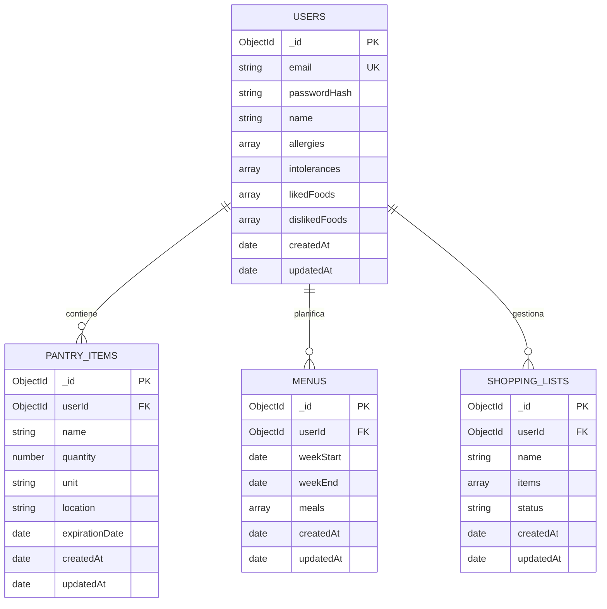

# Viabilidad técnica Apañao
 
 ## FUNCIONALIDADES PRINCIPALES

**Entre 10 y 20 funcionalidades principales de Apañao:**

1. **Gestión de Autenticación:**  
     El usuario puede registrarse e iniciar sesión en la aplicación

2. **Alta de Ingredientes:**  
     El usuario puede añadir un nuevo ingrediente al inventario de la despensa

3. **Actualización de Alimentos:**
     El usuario puede actualizar la cantidad o la fecha de caducidad de un producto en la despensa o la nevera

4. **Baja de Productos:**  
     El usuario puede eliminar un producto agotado o caducado del inventario

5. **Consulta de la despensa:**  
     El usuario puede consultar la lista completa de alimentos disponibles en su despensa

6. **Planificación de menús:**  
     El usuario puede generar menús semanales personalizados (seguramente con implementación de alguna API)

7. **Sugerencia de recetas:**  
     El usuario puede generar una propuesta de receta basada en los ingredientes disponibles en la despensa.

8. **Gestión de favoritos:**  
     El usuario puede marcar una receta como favorita para consultarla rápidamente

9. **Sincronización con la compra:**  
     El usuario puede añadir automáticamente los ingredientes faltantes de una receta a su lista de la compra

10. **Consulta la lista de la compra:**  
      El usuario puede consultar y editar los productos de su lista de la compra pendiente

11. **Traspaso a Despensa:**  
      El usuario puede marcar los productos de la lista de la compra como comprados para pasarlos directamente a la despensa virtual

12. **Alertas de caducidad:**  
      El usuario puede configurar alertas o avisos de productos próximos a caducar

13. **Configuración del perfil:**  
      El usuario puede configurar su perfil a su gusto, para recibir un trato más personalizado

14. **Gestión de alérgenos:**  
      El usuario puede seleccionar los alimentos a los que es alérgico y añadir sus intolerancias, como pueden ser el gluten o la lactosa

15. **Registro de tuppers:**  
      El usuario puede registrar un nuevo tupper cocinado especificando el plato, las raciones disponibles y la fecha de elaboración

16. **Alertas de descongelación:**  
      El usuario recibirá notificaciónes de descongelar el tupper los días que la app haya decidido que ese día se come tupper.

17. **Consulta de tuppers:**  
      El usuario puede consultar su stock de tuppers guardados en el congelador o la nevera con sus respectiva fecha de consumo preferente

18. **Menús semanales:**  
      El usuario podrá generar semanalmente un horario de comidas de todos los días en base a la comida que haya en la despensa, la nevera o los tuppers disponibles.

19. **Descuento de tupper:**  
      El usuario puede descontar una ración del tupper al incluirlo en la planificación de comida semanal.

20. **Gestión de favoritos:**  
      El usuario puede marcar una receta como favoritapara tenerla siempre accesible rápidamente.

### MUST HAVE

*Obligatorias, sin esto no funciona la app*  

Las funcionalidades escenciales de **Apañao**, son las siguientes:  

- **Registro de usuarios:** Registrarse en la app introduciendo correo y contraseña  

- **Inicio de sesión:** Iniciar sesión para acceder a tu espacio privado  

- **Configuración de un perfil:** Editar los datos personales y las preferencias de configuración de cada usuario  

- **Gestión de alérgenos:** Seleccionar alérgenos e intolerancias para poder filtrar recetas que no puedan comer por los alérgenos

- **Alta de ingredientes:** Añadir un nuevo ingredienteal inventario de la despensa

- **Consulta de despensa:** Consultar la lista completa de alimentos disponibles en la despensa

- **Planificación de menús:** Crear menú semanal personalizado combinando recetas y tuppers.

- **Sincronización con la compra:** Añadir automáticamente los ingredientes faltantes del menú a la lista

- **Consulta lista de la compra:** Consultar y editar lista de la compra pendiente


### SHOULD HAVE

*Aportan bastante valor y completan la experiencia principal, pero la app podría seguir funcionando sin ellas*

* **Cierre de sesión:** Cerrar sesión de manera segura para proteger la información personal

* **Actualización de Alimentos:** Actualizar la cantidad o datos de un alimento existente en la despensa.
- **Baja de Productos:** Eliminar un producto agotado o caducado del inventario.

- **Registro de Tuppers:** Registrar un nuevo tupper cocinado especificando raciones y fecha.

- **Consulta de Tuppers:** Consultar el stock de tuppers guardados en nevera o congelador.

- **Descuento de Tuppers:** Descontar una ración de un tupper al incluirlo en el menú semanal.

- **Sugerencia de Recetas:** Generar propuestas de recetas basadas en los ingredientes y alérgenos.

- **Traspaso a Despensa:** Marcar productos comprados para trasladarlos directamente a la despensa.


### COULD HAVE

*Funcionalidades secundarias o mejoras que mejoran la comodidad del usuario si el calendario de desarrollo lo permite*

- **Gestión de Favoritos:** Marcar una receta como favorita para tenerla accesible rápidamente.

- **Alertas de Caducidad:** Configurar avisos visuales de productos próximos a caducar en la despensa.


### WON'T HAVE

*Características más avanzadas que no se añadirán en esta primera versión*

* **Compartir Inventario o Menús en Red:** Sincronizar la despensa en tiempo real con compañeros de piso o familiares


## DEFINICIÓN DEL MVP

En este apartado definimos el prodcuto mínimo viable de nuestra aplicación ***Apañao***:


* **Entrada y configuración inicial:**  
  El usuario abre la aplicación, realiza el Registro de Usuario, inicia sesión y configura rápido su perfil, añadiendo sus intolerancias, sus alergias y los alimentos que le gustan y los que no

* **Inventario básico:**  
  Añade los pocos ingredientes que tengas ahora mismo en la nevera y revisa lo que hay disponible

* **Cierre del ciclo:**  
La aplicación detecta automáticamente qué alimentos faltan para los menús y te genera una lista de la compra (*por ahora estaría disponible mercadona y carrefour, son las únicas APIs que hemos encontrado hasta el último día que hablamos el equipo*)


### **Requisitos que forman parte del MVP:**

Los requisitos indispensables sin los cuales este recorrido mínimo se rompe y no funciona son exclusivamente nuestras funcionalidades **Must have**:

- Registro de Usuario

- Inicio de Sesión

- Configuración de Perfil

- Gestión de Alérgenos

- Alta de Ingredientes

- Consulta de Despensa

- Planificación de Menús

- Sincronización con la Compra

- Consulta de la Lista de la Compra

*Todo lo demás (como el control de tuppers, las sugerencias automáticas avanzadas de recetas, el histórico o las alertas de caducidad) queda fuera de esta primera versión (MVP), ya que el usuario puede completar su objetivo principal sin ellas.*

## ANÁLISIS DE REQUISITOS TÉCNICOS

### 1. Frontend (React)

Para garantizar una experiencia rápida, reactiva y fluida en dispositivos móviles, utilizaremos (en la medida de lo posible y si es completamente necesario) las siguientes bibliotecas dentro del entorno **React** (vía Vite o Create React App):

| Biblioteca | Función / Ámbitos | Justificación y Por Qué la Necesitamos |
| ----- | ----- | ----- |
| **React Router (v6+)** | Navegación y Enrutamiento | Gestión de rutas dinámicas (pantallas de despensa, planificador, lista de la compra, recetas y tique). Permite la navegación fluida sin recargar la página (*Single Page Application*). |
| **Zustand** (o **Context API**) | Gestión de Estado Global | Manejo simplificado y ligero del estado del cliente (despensa temporal, filtros de recetas y carrito de la compra activo) antes o entre sincronizaciones con la API de Node.js. |
| **Axios** | Cliente HTTP | Gestión de peticiones hacia nuestro backend en Node.js/Express (obtención de recetas, actualización de inventario, registro/login). Facilita interceptores para el envío de tokens (JWT) y manejo centralizado de errores. |
| **TanStack Query (React Query)** | Gestión de Peticiones y Caché | Optimiza las peticiones a la API Express, evitando llamadas repetitivas al servidor, gestionando la caché de recetas/productos y refrescando los datos automáticamente cuando el usuario interactúa. |
| **Tailwind CSS + Lucide React** | Estilos e Iconos | Diseño *mobile-first* ágil, adaptado a interfaces simples para jóvenes, e integración de iconografía ligera y clara para la gestión de Nevera, Táper, Monedas y Presupuesto. |

---

### 2. Backend (Node.js + Express)

Para gestionar la lógica de negocio de **Apañao**, utilizaremos **Node.js con Express**, desarrollando una API REST que actuará como intermediaria entre el frontend en React y la base de datos MongoDB. El backend será responsable de gestionar las cuentas de usuario, controlar el acceso a los datos personales, administrar la despensa y coordinar la planificación de menús con la generación de la lista de la compra.

| Biblioteca / Tecnología | Función / Ámbitos | Justificación y Por Qué la Necesitamos |
| ----- | ----- | ----- |
| **Node.js** | Entorno de ejecución del servidor | Permite ejecutar JavaScript en el backend y utilizar el mismo lenguaje en toda la aplicación, facilitando el desarrollo y el mantenimiento del proyecto. |
| **Express.js** | Servidor y API REST | Gestiona las rutas HTTP y las peticiones procedentes de React. Permitirá implementar las operaciones CRUD (*Create, Read, Update, Delete*) necesarias para administrar los ingredientes, los menús y las listas de la compra. |
| **Mongoose** | Modelado y acceso a MongoDB | Facilita la definición de esquemas, la validación de documentos y las consultas a la base de datos. También permite establecer referencias entre usuarios, ingredientes, menús y listas de la compra. |
| **JSON Web Token (JWT)** | Autenticación y autorización | Permitirá identificar a los usuarios autenticados mediante tokens firmados. El backend comprobará el token en las rutas privadas para garantizar que cada usuario solo pueda acceder a sus propios datos. |
| **bcrypt** (o bcryptjs) | Protección de contraseñas | Permite almacenar las contraseñas mediante un hash seguro, evitando guardar las contraseñas originales en la base de datos. |
| **Zod** (o express-validator) | Validación de datos de la APO | Comprueba que los datos recibidos desde el frontend tienen el formato esperado antes de procesarlos o guardarlos, reduciendo errores y peticiones inválidas. |
| **dotenv** | Gestión de variables de entorno | Permite configurar de forma segura parámetros como la URL de MongoDB, el secreto de firma de JWT y las credenciales de servicios externos, sin incluirlos directamente en el código fuente. |
| **Helmet y express-rate-limit** | Seguridad de la API | Helmet configura cabeceras HTTP de seguridad y express-rate-limit limita el número de peticiones, especialmente en las rutas de registro e inicio de sesión, para reducir ciertos abusos y ataques automatizados. |

#### Autenticación y gestión del sistema de cuentas

Se utilizará un sistema de **autenticación propia basado en correo electrónico, contraseña y JWT**, integrado en el backend mediante Express. No será necesario depender de un proveedor externo de identidad para el MVP.

El funcionamiento será el siguiente:

1. **Registro:** el usuario introduce su correo electrónico y contraseña. El backend valida los datos, comprueba que el correo no esté registrado y almacena la contraseña como un hash generado con bcrypt.
2. **Inicio de sesión:** el backend verifica las credenciales y genera un JWT firmado con un secreto almacenado en las variables de entorno.
3. **Acceso a rutas privadas:** React enviará el token en la cabecera `Authorization: Bearer <token>` de las peticiones protegidas. Un middleware de Express verificará su firma y caducidad antes de permitir el acceso.
4. **Autorización:** cada operación utilizará el identificador del usuario autenticado para filtrar los documentos de MongoDB. El backend no confiará en un identificador de usuario enviado libremente por el frontend.
5. **Cierre de sesión:** el cliente eliminará el token y los datos de sesión almacenados. Si en el futuro se necesita invalidación inmediata de tokens o gestión avanzada de sesiones, se podrá añadir un mecanismo de revocación.


#### Principales endpoints de la API

La API se organizará por recursos, utilizando el prefijo `/api/v1` para facilitar futuras ampliaciones.

| Recurso | Endpoints principales | Funcionalidad |
| ----- | ----- | ----- |
| **Autenticación** | `POST /auth/register` · `POST /auth/login` · `GET /auth/me` | Registro, inicio de sesión y consulta de la sesión del usuario autenticado. |
| **Perfil** | `GET /users/me` · `PATCH /users/me` | Consulta y actualización del perfil, preferencias alimentarias, alergias e intolerancias. |
| **Despensa** | `GET /pantry` · `POST /pantry` · `PATCH /pantry/:id` · `DELETE /pantry/:id` | Consulta, alta, actualización y eliminación de ingredientes. |
| **Menús** | `GET /menus` · `POST /menus` · `GET /menus/:id` · `PATCH /menus/:id` | Creación y consulta de menús semanales y modificación de su planificación. |
| **Lista de la compra** | `GET /shopping-lists` · `POST /shopping-lists` · `PATCH /shopping-lists/:id` | Consulta, creación y actualización de las listas de la compra. |
| **Sincronización con la compra** | `POST /shopping-lists/:id/sync` | Calcula los ingredientes necesarios para el menú que no están disponibles en la despensa y los añade a la lista de la compra sin duplicarlos innecesariamente. |

La planificación de menús y la generación de listas se implementarán inicialmente mediante lógica de negocio en el backend. Si se utilizan APIs externas de recetas o productos de supermercados, las llamadas se realizarán desde el servidor cuando sea necesario, manteniendo las claves privadas fuera del frontend. La disponibilidad real de APIs de Mercadona y Carrefour, así como sus condiciones de uso, deberá verificarse antes de integrar estas fuentes.

---

### 3. Base de Datos (MongoDB)

Se utilizará **MongoDB Atlas** como servicio de base de datos en la nube y **Mongoose** como herramienta de modelado y acceso desde Node.js. La aplicación tendrá una base de datos independiente para sus datos y utilizará identificadores `ObjectId` para relacionar los documentos.

#### Colecciones principales

Para el MVP se proponen cuatro colecciones principales:

| Colección | Contenido y finalidad |
| ----- | ----- |
| **users** | Cuentas de usuario, credenciales protegidas, perfil, alergias, intolerancias, alimentos preferidos y alimentos que el usuario desea evitar. |
| **pantry_items** | Ingredientes de la despensa de cada usuario, con nombre, cantidad, unidad de medida, ubicación de almacenamiento y fecha de caducidad opcional. |
| **menus** | Planes semanales de comidas asociados a cada usuario, con las fechas del periodo y las comidas planificadas, incluyendo los datos necesarios para identificar las recetas seleccionadas. |
| **shopping_lists** | Listas de la compra asociadas a cada usuario, con sus productos, cantidades y estado pendiente o comprado. Permiten registrar los ingredientes que faltan para completar un menú. |

Las relaciones entre colecciones se establecerán mediante referencias a los identificadores de MongoDB. Cada documento de despensa, menú y lista de la compra incluirá una referencia al usuario propietario. De este modo, se podrá consultar y modificar la información de forma independiente para cada cuenta.

Para mantener el MVP sencillo, los elementos de las comidas planificadas y los productos de cada lista de la compra podrán almacenarse como subdocumentos dentro de sus respectivas colecciones. No será necesario crear una colección independiente para cada receta o cada producto de la lista.

#### Esquema de la base de datos en Mermaid

El siguiente diagrama representa las relaciones propuestas entre las cuatro colecciones. Los campos mostrados son orientativos y podrán concretarse al implementar los modelos de Mongoose.



#### Validaciones, integridad y seguridad de los datos

Para evitar inconsistencias y proteger la información personal, se aplicarán las siguientes medidas:

- **Identificación única:** cada documento tendrá un identificador `_id`. El correo electrónico de `users` tendrá un índice único para evitar registros duplicados.
- **Aislamiento de datos:** las consultas de despensa, menús y listas deberán incluir tanto el identificador del recurso como el del usuario autenticado.
- **Validación de campos:** Mongoose y el backend validarán cantidades positivas, unidades permitidas, fechas coherentes y los campos obligatorios de cada documento.
- **Integridad de la planificación:** al generar la lista de la compra, el backend comparará los ingredientes necesarios con los disponibles y calculará las cantidades faltantes. Se evitará añadir repetidamente el mismo producto por cada actualización del menú.
- **Protección de credenciales:** la colección `users` almacenará `passwordHash`, nunca la contraseña original ni el token de sesión como sustituto de la contraseña.
- **Índices de consulta:** se crearán índices para `users.email` y para las referencias `userId` de las colecciones principales. En función de las consultas definitivas, se podrán añadir índices compuestos por usuario y fecha.
- **Trazabilidad temporal:** los campos `createdAt` y `updatedAt`, gestionados mediante Mongoose, facilitarán conocer cuándo se creó o modificó un documento.

La colección de recetas no se considera imprescindible para el MVP. Si la aplicación obtiene recetas desde una API externa, se podrán almacenar los datos esenciales de cada receta dentro del menú semanal. Si más adelante se necesita un catálogo propio, caché de recetas, favoritos o un histórico, se podrá incorporar una colección `recipes` sin modificar la arquitectura principal.

### 3. Base de Datos (MongoDB)


---

### 4. Infraestructura y Despliegue Cloud (Stack MERN)

Se plantea una arquitectura dividida (*Decoupled Architecture*) con coste **$0/mes** durante la fase de prototipo y validación.

```
                  ┌─────────────────────────────────┐
                  │          Vercel (Free)          │
                  │   Aplicación React (Frontend)   │
                  └────────────────┬────────────────┘
                                   │  Peticiones API (REST/HTTP)
                                   ▼
                  ┌─────────────────────────────────┐
                  │     Render / Railway (Free)     │
                  │    Backend Express (Node.js)    │
                  └────────────────┬────────────────┘
                                   │  (Futuro)
                                   ▼
                   [ MongoDB Atlas - Free Tier ]
```

### Unidades de Despliegue y Planes Gratuitos

#### 1. Frontend (React)
* **Plataforma seleccionada:** **Vercel** *(o Netlify)*.
* **Por qué:** Despliegue continuo automático desde GitHub, CDN global rápida para aplicaciones web estáticas/SPAs.
* **Condiciones del Plan Gratuito (Vercel Hobby):**
  * **Ancho de banda:** 100 GB/mes.
  * **Límites:** Totalmente suficiente para prototipos y miles de usuarios iniciales sin ningún coste.

#### 2. Backend (Node.js / Express API)
* **Plataforma seleccionada:** **Render** *(opción alternativa: Railway / Koyeb)*.
* **Por qué:** Permite desplegar servidores Web Services en Node.js de forma directa desde repositorios Git.
* **Condiciones del Plan Gratuito (Render Free Instance):**
  * **RAM / CPU:** 512 MB RAM, CPU compartida.
  * **Comportamiento:** El servicio entra en "reposo" (*spin down*) tras 15 minutos de inactividad, tardando unos 20-30 segundos en despertar en la primera petición tras el estado de reposo (comportamiento habitual y aceptable en fases de prueba/evaluación académica).

---

### Resumen de Viabilidad Económica

* **Frontend (React):** 0 € / mes (Vercel)
* **Backend (Node.js + Express):** 0 € / mes (Render)
* **Coste Total Operativo:** **0 € / mes**

> **Conclusión técnica:** El uso del stack **MERN** desplegado de forma independiente en plataformas SaaS especializadas (Vercel + Render) garantiza una arquitectura profesional, escalable y con coste cero durante la validación de la idea.


